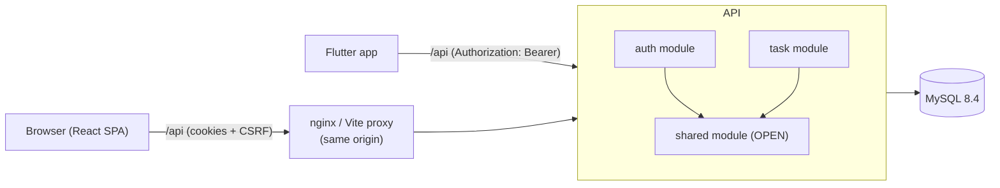
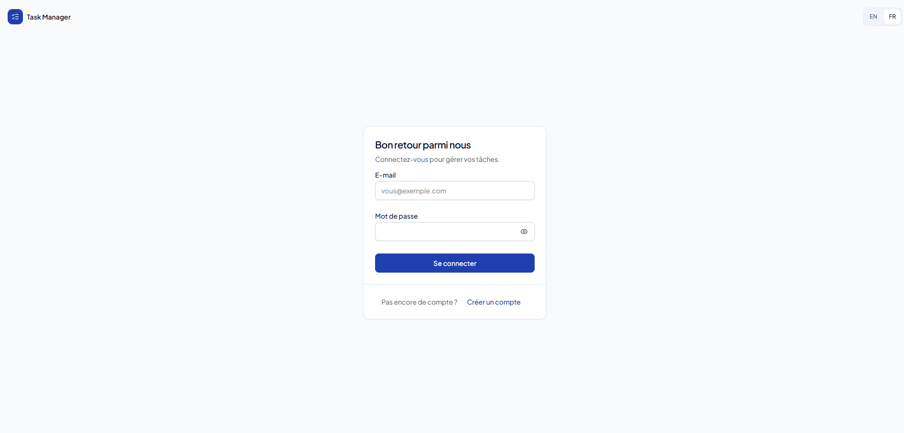
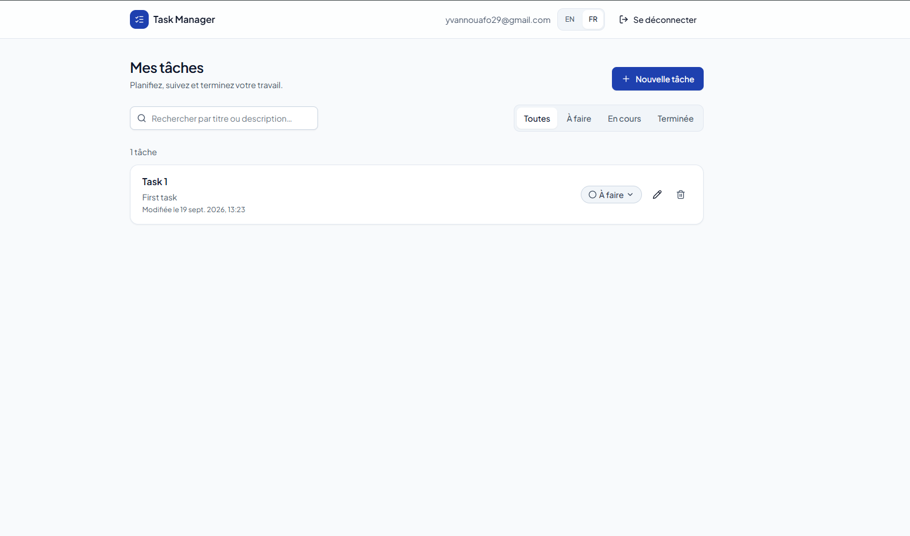
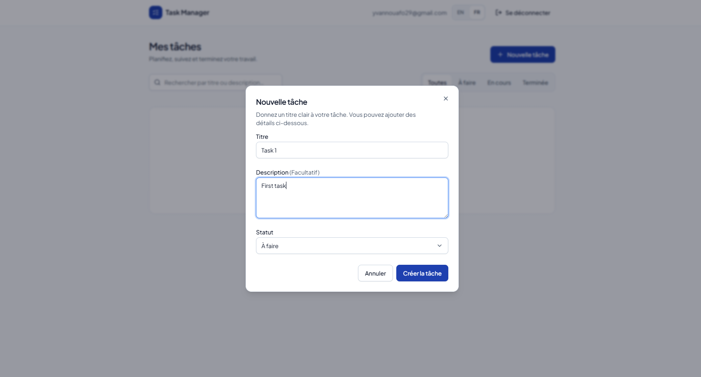
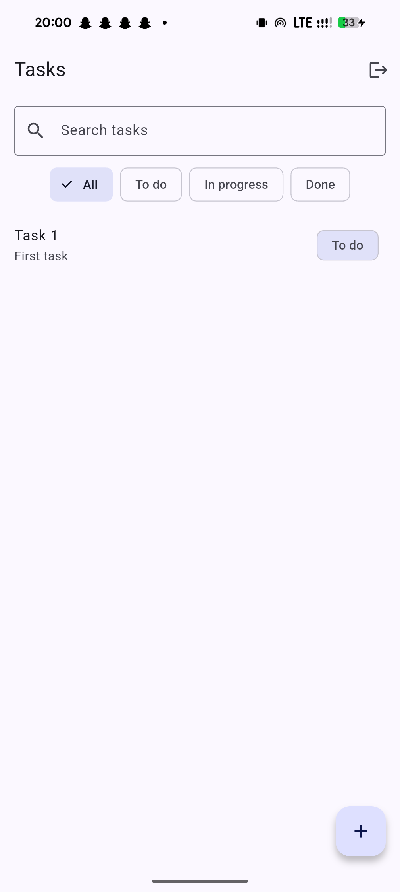

<div align="center">

# ✅ Task Manager

### JWT-authenticated task manager — Spring Boot API, React web client, Flutter mobile client

A full-stack recruitment-test monorepo: register/login, create/list/edit/delete tasks with status filtering, text search and pagination

[](backend/README.md)
[](backend/README.md)
[](frontend/README.md)
[](frontend/README.md)
[](mobile/README.md)
[](docker-compose.yml)
[](https://github.com/Navy-sama/task_manager/actions/workflows/ci.yml)

[Features](#-features) • [Quick Start](#-quick-start) • [Documentation](#-documentation) • [Backend](backend/README.md) • [Frontend](frontend/README.md) • [Mobile](mobile/README.md)

</div>

---

## 📋 Table of Contents

- [Overview](#-overview)
- [Features](#-features)
- [Architecture](#-architecture)
- [Tech Stack](#-tech-stack)
- [Prerequisites](#-prerequisites)
- [Quick Start](#-quick-start)
- [Configuration](#-configuration)
- [Project Structure](#-project-structure)
- [Testing](#-testing)
- [Build & CI/CD](#-build--cicd)
- [Security](#-security)
- [Deployment](#-deployment)
- [Design Decisions & Trade-offs](#-design-decisions--trade-offs)
- [Known Limitations](#-known-limitations)
- [Screenshots](#-screenshots)
- [Documentation](#-documentation)
- [Troubleshooting](#-troubleshooting)

---

## 🎯 Overview

> A JWT-authenticated task manager: register/login, create/list/edit/delete tasks with status filtering, text search and pagination.

Monorepo — **Spring Boot + MySQL** backend, **React + Vite** web client, **Flutter** mobile client (bonus), **GitHub Actions + Docker + GCP Cloud Run** CI/CD (bonus). The backend is the priority and the most complete part; see [Design Decisions & Trade-offs](#-design-decisions--trade-offs) for what that prioritization traded off.

<table>
<tr>
<td>

**🧩 Monorepo parts**

- `backend/` — Spring Boot REST API
- `frontend/` — React SPA
- `mobile/` — Flutter app (bonus)

</td>
<td>

**🔐 Auth model**

- Web: `HttpOnly` cookies + CSRF
- Mobile: `Authorization: Bearer`
- Shared JWT + refresh-token rotation

</td>
</tr>
</table>

---

## ✨ Features

### ✅ Required by the spec

| Feature                              | Status        | Notes                                                                                       |
| ------------------------------------ | ------------- | ------------------------------------------------------------------------------------------- |
| `POST /api/auth/register`            | Done          | Signs the user in immediately (see deviations)                                              |
| `POST /api/auth/login`               | Done          | Generic error on failure (no email enumeration)                                             |
| `GET /api/tasks`                     | Done          | + status filter, text search, pagination (beyond the minimum)                               |
| `POST /api/tasks`                    | Done          |                                                                                             |
| `PUT /api/tasks/{id}`                | Done          | Full replacement                                                                            |
| `DELETE /api/tasks/{id}`             | Done          |                                                                                             |
| `User` / `Task` entities             | Done          | `Task`: title, description, status, createdAt, updatedAt                                    |
| Web: auth, list, CRUD                | Done          |                                                                                             |
| Web: filter by status + search       | Done          |                                                                                             |
| Web: toasts                          | Done          | `sonner`                                                                                    |
| Web: JWT in cookie or `localStorage` | Done (cookie) | `HttpOnly` cookie chosen over `localStorage` — see [`docs/decisions.md`](docs/decisions.md) |

### 🎁 Bonus

| Feature                                   | Status               | Notes                                                                                                                                   |
| ----------------------------------------- | -------------------- | --------------------------------------------------------------------------------------------------------------------------------------- |
| Mobile (Flutter): same JWT, list + create | Done                 | See [`mobile/README.md`](mobile/README.md)                                                                                              |
| CI: build + test on every push            | Done                 | `.github/workflows/ci.yml`                                                                                                              |
| Docker images (backend + frontend)        | Done                 | `backend/Dockerfile`, `frontend/Dockerfile`, compose profile `app`                                                                      |
| Deploy to GCP                             | Ready, not activated | Cloud Run + Cloud SQL workflow written and documented; not live because it needs a GCP billing account — see [Deployment](#-deployment) |

### 🚀 Beyond the spec

<table>
<tr>
<td width="50%">

**🔐 Auth & security**

- `POST /api/auth/refresh`, `POST /api/auth/logout`, `GET /api/auth/me` — a 15-minute access token is unusable without a refresh flow
- Rotating refresh tokens with reuse detection (theft revokes every session of the user)
- CSRF protection (double-submit cookie) for the web client
- Ownership mismatch returns `404`, never `403` — existence of another user's task is never disclosed

</td>
<td width="50%">

**🛠 API & tooling**

- Pagination (`page`/`size`, clamped, `PageResponse<T>`) instead of returning the full list
- RFC 9457 `ProblemDetail` error responses with a stable `code` for every error, including from the security filter chain
- i18n: English + French, on both the error messages and the UI
- OpenAPI / Swagger UI (`springdoc`) generated from the code
- JaCoCo ≥ 80% coverage gate and Spring Modulith module-boundary tests (`ModularityTest`) enforced in CI

</td>
</tr>
</table>

---

## 🏗 Architecture



The backend is a single Spring Boot app organised as a light **Spring Modulith**: `auth` (accounts, JWT, refresh-token rotation, cookies, the security filter chain) and `task` (CRUD, filter, search) each depend only on `shared` (`OPEN` module: error model, pagination, current-user resolution) — `task` never has a JPA relation to `auth`'s `User`, only the owner's id, so the modules stay decoupled and independently testable. A `ModularityTest` enforces this on every build. Full diagrams (module table, request-flow sequence, ER diagram): [`docs/architecture.md`](docs/architecture.md).

---

## 🛠 Tech Stack

<details open>
<summary><b>⚙️ Backend</b></summary>

| Package                              | Version                       | Purpose                                      |
| ------------------------------------ | ----------------------------- | -------------------------------------------- |
| Java                                 | `21`                          | Language / runtime                           |
| Spring Boot                          | `4.1.1`                       | Application framework                        |
| Spring Modulith                      | `2.1.1`                       | Module boundaries + `ModularityTest`         |
| springdoc-openapi                    | `3.1.1`                       | OpenAPI / Swagger UI generated from the code |
| MySQL (runtime) / H2 (local tests)   | `8.4` / in-memory, MySQL mode | Persistence                                  |
| Flyway                               | (Spring Boot–managed)         | Schema migrations                            |
| JaCoCo                               | `0.8.15`                      | ≥ 80% line coverage gate                     |
| Spotless (`palantirJavaFormat`)      | `3.10.2`                      | Formatting, enforced in CI                   |
| `mysql-socket-factory-connector-j-8` | `1.30.0`                      | Cloud SQL socket connections (no public IP)  |

</details>

<details>
<summary><b>⚛️ Frontend</b></summary>

| Package                             | Version               | Purpose                       |
| ----------------------------------- | --------------------- | ----------------------------- |
| React                               | `19.3`                | UI library                    |
| Vite                                | `8.3`                 | Dev server & build            |
| TypeScript                          | `6.0`                 | Static typing                 |
| TanStack Query                      | `5.103`               | Server cache & async requests |
| axios                               | `1.20`                | HTTP client (cookies + CSRF)  |
| Zustand                             | `5.0`                 | Session state                 |
| React Hook Form + Zod               | `7.88` + `4.6`        | Forms & schema validation     |
| Tailwind CSS + shadcn/ui (radix-ui) | `4.3`                 | Styling & UI primitives       |
| i18next / react-i18next             | `26.4` / `17.0`       | Internationalization (EN/FR)  |
| Vitest, Testing Library, MSW        | `5.0`, `16.3`, `2.15` | Testing                       |

Full list including `sonner`, `lucide-react`, `react-router`, ESLint and Prettier versions: [`frontend/README.md`](frontend/README.md).

</details>

<details>
<summary><b>📱 Mobile</b></summary>

```
Flutter (stable, 3.29.3)  •  Dart SDK ^3.7.2  •  dio  •  flutter_secure_storage  •  provider
```

See [`mobile/README.md`](mobile/README.md) for the full dependency table with resolved versions.

</details>

<details>
<summary><b>🔧 CI/CD</b></summary>

```
GitHub Actions  •  Docker  •  GCP (Cloud Run, Cloud SQL, Artifact Registry, Secret Manager, Workload Identity Federation)
```

Full pipeline: [`docs/deployment.md`](docs/deployment.md).

</details>

---

## 📦 Prerequisites

<table>
<tr>
<td width="50%">

### 🐳 Option A — Docker

- ✅ Docker & Docker Compose
- ✅ OpenSSL (or Node.js) to generate `JWT_SECRET`

</td>
<td width="50%">

### 💻 Option B — Local dev

- ✅ Java 21 (Temurin recommended) — `mvnw`/`mvnw.cmd` included
- ✅ Node.js `≥ 24` and pnpm
- ✅ MySQL 8.4 (or Docker just for the database)
- ✅ Flutter stable `3.29.3` + Android toolchain (mobile only)

</td>
</tr>
</table>

---

## 🚀 Quick Start

### 1️⃣ Clone & configure

```bash
git clone https://github.com/Navy-sama/task_manager.git
cd task_manager

cp .env.example .env
# generate a JWT secret and add it to .env:
openssl rand -base64 32
# (or: node -e "console.log(require('crypto').randomBytes(32).toString('base64'))")
```

### 2️⃣ Start the full stack with Docker

```bash
docker compose --profile app up -d --build
```

### 3️⃣ Open the app

> 🎉 **http://localhost:8080** — nginx serves the built SPA and reverse-proxies `/api` to the backend, so auth cookies stay same-origin. See [`docs/deployment.md`](docs/deployment.md) for what each service does.

<details>
<summary><b>💡 Other ways to run it</b></summary>

**Option B — local development (hot reload)**

```bash
docker compose up -d                 # MySQL only

cp backend/.env.example backend/.env # fill in JWT_SECRET (see step 1 above)
cd backend && ./mvnw spring-boot:run # http://localhost:8080, Swagger UI at /swagger-ui.html

cp frontend/.env.example frontend/.env   # only if the API isn't on localhost:8080
cd frontend && pnpm install && pnpm dev  # http://localhost:5173, proxies /api (see vite.config.ts)
```

Backend details (env vars, profiles, migrations): [`backend/README.md`](backend/README.md). Frontend details (scripts, structure, testing): [`frontend/README.md`](frontend/README.md).

**Option C — mobile**

See [`mobile/README.md`](mobile/README.md).

</details>

---

## ⚙️ Configuration

### 🔧 Root `.env` (Docker Compose)

| Variable              | Default       | Notes                                                                            |
| --------------------- | ------------- | -------------------------------------------------------------------------------- |
| `MYSQL_DATABASE`      | `taskmanager` |                                                                                  |
| `MYSQL_USER`          | `taskmanager` |                                                                                  |
| `MYSQL_PASSWORD`      | — (required)  | No default in the versioned file — a default password would be a public password |
| `MYSQL_ROOT_PASSWORD` | — (required)  |                                                                                  |
| `MYSQL_PORT`          | `3306`        | Bound to `127.0.0.1` only                                                        |
| `JWT_SECRET`          | — (required)  | `--profile app` only — Base64 HMAC key, ≥ 32 bytes                               |
| `BACKEND_PORT`        | `8081`        | `--profile app` only                                                             |
| `FRONTEND_PORT`       | `8080`        | `--profile app` only                                                             |

### 🔧 `backend/.env`

See [`backend/README.md`](backend/README.md#-configuration) for the full table (`DATABASE_URL`, `JWT_SECRET`, `CORS_ALLOWED_ORIGINS`, `PORT`) and Spring profiles (`dev`, `test`, `prod`).

### 🔧 `frontend/.env`

See [`frontend/README.md`](frontend/README.md#-environment--proxy) for `VITE_API_PROXY_TARGET`.

---

## 📁 Project Structure

```
task_manager/
├── ⚙️ backend/            # Spring Boot API (Java 21, Maven) — see backend/README.md
│   ├── src/               #   auth / task / shared Spring Modulith modules
│   ├── pom.xml
│   └── Dockerfile
├── ⚛️ frontend/           # React + Vite SPA — see frontend/README.md
│   ├── src/               #   app / components / features / i18n / lib / test
│   ├── package.json
│   └── Dockerfile
├── 📱 mobile/             # Flutter app (bonus) — see mobile/README.md
├── 📚 docs/               # architecture, security, decisions, deployment, API contract
│   ├── api-contract.md    #   endpoint reference shared by all 3 clients
│   ├── architecture.md    #   module table, request-flow sequence, ER diagram
│   ├── security.md        #   auth sequence diagrams, threat notes
│   ├── decisions.md        #   rationale for every numbered decision
│   ├── deployment.md      #   CI/CD pipeline, GCP setup, rollback
│   └── screenshots/       #   web-login.png, web-tasks.png, web-create.png, mobile-tasks.png
├── 🔧 .github/workflows/  # ci.yml, deploy.yml
├── 🐳 docker-compose.yml  # MySQL only (default) or full stack (--profile app)
└── 🔑 .env.example
```

---

## 🧪 Testing

| Part             | Command                                                  | Covers                                                                                                                                                                                                                            |
| ---------------- | -------------------------------------------------------- | --------------------------------------------------------------------------------------------------------------------------------------------------------------------------------------------------------------------------------- |
| Backend          | `./mvnw verify`                                          | Unit tests (JUnit 5, Mockito, AssertJ) + integration tests (`@SpringBootTest`/MockMvc) against H2 in MySQL mode locally, a real MySQL 8.4 service in CI; `ModularityTest`; Spotless format check; JaCoCo ≥ 80% line coverage gate |
| Backend (format) | `./mvnw spotless:apply`                                  | Auto-formats Java; CI runs with `-Dspotless.apply.skip=true` so unformatted code fails                                                                                                                                            |
| Frontend         | `pnpm lint && pnpm typecheck && pnpm test && pnpm build` | ESLint + Prettier, `tsc`, Vitest + React Testing Library against a mocked API (MSW), production build                                                                                                                             |
| Mobile           | `flutter analyze && flutter test`                        | See [`mobile/README.md`](mobile/README.md)                                                                                                                                                                                        |

CI (`.github/workflows/ci.yml`) runs all of the above on every push, the backend against a real MySQL 8.4 service container (not H2) to catch anything H2's MySQL-compatibility mode doesn't cover exactly.

---

## 🏗 Build & CI/CD

### Pipeline (`ci.yml`)

```
push / pull_request
   ├── backend   → ./mvnw verify (MySQL 8.4 service, Spotless check, JaCoCo gate)
   ├── frontend  → pnpm lint && pnpm typecheck && pnpm test && pnpm build
   ├── mobile    → flutter analyze && flutter test (skipped gracefully if mobile/ doesn't exist yet)
   └── docker    → builds backend + frontend images (no push), needs [backend, frontend]
```

### Deploy pipeline (`deploy.yml`)

```
push main  →  ci.yml (reused)  →  deploy (Cloud Run), guarded by: if: vars.GCP_PROJECT_ID != ''
```

Builds and pushes Docker images to Artifact Registry, deploys the backend to Cloud Run (Cloud SQL MySQL 8.4 + Secret Manager, via Workload Identity Federation — no long-lived key), health-checks it, then deploys the nginx-fronted SPA and smoke-tests it. Full details, one-time GCP setup and rollback notes: [`docs/deployment.md`](docs/deployment.md).

### Repository variables required to activate `deploy.yml`

| Variable                                                | Purpose                                                   |
| ------------------------------------------------------- | --------------------------------------------------------- |
| `GCP_PROJECT_ID`                                        | Also the gate: deploy is skipped, not failed, while empty |
| `GCP_REGION`, `GAR_REPOSITORY`                          | Artifact Registry location                                |
| `GCP_WORKLOAD_IDENTITY_PROVIDER`, `GCP_SERVICE_ACCOUNT` | Workload Identity Federation auth                         |
| `CLOUDSQL_INSTANCE`, `DB_NAME`, `DB_USER`               | Cloud SQL connection                                      |
| `RUNTIME_SERVICE_ACCOUNT`                               | Cloud Run backend service account                         |

`DATABASE_PASSWORD` and `JWT_SECRET` are read from **GCP Secret Manager** at deploy time (`--set-secrets`), not from GitHub secrets.

---

## 🔒 Security

- **Web:** `HttpOnly`, `SameSite=Strict` cookies for the access token (`Path=/api`, 15 min) and refresh token (`Path=/api/auth`, 7 days) — JavaScript never sees a token. CSRF via double-submit cookie (`X-XSRF-TOKEN` header checked against the `XSRF-TOKEN` cookie) on every mutation.
- **Mobile:** `Authorization: Bearer` header; tokens returned in the JSON body only when the request carries `X-Client-Type: mobile`. No CSRF check (not applicable to non-browser clients).
- **Refresh tokens:** opaque 256-bit random values, stored only as SHA-256 hashes, rotated on every use. Reusing an already-used token is treated as theft: every refresh token belonging to that user is revoked.
- **Passwords:** BCrypt. **Login failures:** one generic `INVALID_CREDENTIALS` error whether the email is unknown or the password is wrong (no account enumeration).
- **Ownership:** a task belonging to another user returns `404 TASK_NOT_FOUND`, identical to a task that doesn't exist.

Full sequence diagrams (login/refresh/logout for web and mobile) and threat notes: [`docs/security.md`](docs/security.md).

### API summary

Full contract (request/response bodies, validation, all error codes): [`docs/api-contract.md`](docs/api-contract.md).

| Method | Path                 | Auth                   | Purpose                                                            |
| ------ | -------------------- | ---------------------- | ------------------------------------------------------------------ |
| POST   | `/api/auth/register` | public                 | Create an account and sign in                                      |
| POST   | `/api/auth/login`    | public                 | Sign in                                                            |
| POST   | `/api/auth/refresh`  | public (refresh token) | Rotate the refresh token, issue a new access token                 |
| POST   | `/api/auth/logout`   | public (refresh token) | Revoke the refresh token, clear cookies                            |
| GET    | `/api/auth/me`       | required               | Current user                                                       |
| GET    | `/api/tasks`         | required               | List the caller's tasks — filter by `status`, search `q`, paginate |
| POST   | `/api/tasks`         | required               | Create a task                                                      |
| PUT    | `/api/tasks/{id}`    | required               | Replace a task's editable fields                                   |
| DELETE | `/api/tasks/{id}`    | required               | Delete a task                                                      |

---

## ☁️ Deployment

**Status: Ready, not activated (GCP billing required).**

`deploy.yml` reuses the CI workflow, then builds and pushes Docker images to Artifact Registry, deploys the backend to Cloud Run (Cloud SQL MySQL 8.4 + Secret Manager, via Workload Identity Federation — no long-lived key), health-checks it, then deploys the nginx-fronted SPA and smoke-tests it. Full pipeline, one-time GCP setup and rollback notes: [`docs/deployment.md`](docs/deployment.md).

Cloud SQL and Cloud Run require a GCP billing account, which this test does not use. The deploy job is guarded by `if: vars.GCP_PROJECT_ID != ''`, so it is skipped (not failed) until the repository variables are set; CI and the Docker image builds run on every push regardless. The full stack runs locally with the same images via `docker compose --profile app up -d --build`.

---

## 📐 Design Decisions & Trade-offs

- **Cookies over `localStorage`** for the web JWT: `HttpOnly` removes the token from JavaScript's reach entirely, at the cost of needing CSRF protection and a same-origin proxy — both implemented.
- **Refresh-token rotation with reuse detection** rather than long-lived access tokens: more moving parts (a `refresh_tokens` table, a rotation endpoint), but a stolen access token expires in 15 minutes and a stolen refresh token is single-use.
- **`ownerId: Long` instead of a JPA relation** between `task` and `auth`: keeps the Modulith boundary real (verified by `ModularityTest`) at the cost of not being able to `JOIN FETCH` the owner from a task query — never needed here since the API never returns another user's data.
- **Flyway + `ddl-auto=validate`** instead of Hibernate auto-DDL: schema changes are explicit and reviewed SQL files, not implicit and env-dependent.
- **H2 (MySQL mode) for local/unit-level integration tests, real MySQL 8.4 in CI**: fast local loop, still caught by a real engine before merge.

Full rationale for every numbered decision: [`docs/decisions.md`](docs/decisions.md).

---

## ⚠️ Known Limitations

- No login rate limiting or account lockout after repeated failures (flagged debt, not an oversight — see [`docs/security.md`](docs/security.md)).
- No task due dates, priorities, or assignment to other users — out of scope for the spec.
- No per-device session listing or single-session revocation; reuse detection revokes _all_ of a user's refresh tokens at once.
- Mobile app is English-only (no i18n parity with the web client yet) and targets Android only (no iOS project generated).
- GCP deployment is scripted but not live (billing account required).
- Frontend bundle has no route-based code-splitting yet — acceptable at this app's size, worth revisiting if more screens are added.
- No `GET /api/tasks/{id}` endpoint (not required by the spec; the list view carries everything the UI needs).

---

## 📸 Screenshots

| Sign in                                    | Tasks                                        | New task                                            | Mobile                                                 |
| ------------------------------------------ | -------------------------------------------- | --------------------------------------------------- | ------------------------------------------------------ |
|  |  |  |  |

---

## 📚 Documentation

| Document                                       | Description                                                    |
| ---------------------------------------------- | -------------------------------------------------------------- |
| [`docs/api-contract.md`](docs/api-contract.md) | Full API contract — endpoints, bodies, validation, error codes |
| [`docs/architecture.md`](docs/architecture.md) | Module table, request-flow sequence, ER diagram                |
| [`docs/security.md`](docs/security.md)         | Auth sequence diagrams (web & mobile), threat notes            |
| [`docs/decisions.md`](docs/decisions.md)       | Rationale for every numbered design decision                   |
| [`docs/deployment.md`](docs/deployment.md)     | CI/CD pipeline, one-time GCP setup, rollback notes             |
| [`backend/README.md`](backend/README.md)       | Backend setup, configuration, module layout, tests             |
| [`frontend/README.md`](frontend/README.md)     | Frontend setup, scripts, structure, tests                      |
| [`mobile/README.md`](mobile/README.md)         | Mobile setup, architecture, tests                              |

---

## 🔧 Troubleshooting

<details>
<summary><b>🐳 Docker Compose — port already in use</b></summary>

Remap the host ports in `.env`: `MYSQL_PORT`, `BACKEND_PORT`, `FRONTEND_PORT` (see [Configuration](#-configuration)).

</details>

<details>
<summary><b>🔑 Backend won't start — JWT secret error</b></summary>

`JWT_SECRET` must be a Base64-encoded HMAC key that decodes to at least 32 bytes — the app refuses to start otherwise. Regenerate it with `openssl rand -base64 32`.

</details>

<details>
<summary><b>🌐 CORS errors from the browser</b></summary>

Leave `CORS_ALLOWED_ORIGINS` empty when the SPA is served same-origin (the default deployment via nginx or the Vite proxy). Only set it to a comma-separated list of origins when the frontend is served from a different origin than the API.

</details>

<details>
<summary><b>⚛️ Frontend can't reach the API</b></summary>

Check `VITE_API_PROXY_TARGET` in `frontend/.env` — it defaults to `http://localhost:8080`. See [`frontend/README.md`](frontend/README.md#-environment--proxy).

</details>

<details>
<summary><b>🪟 Windows — Maven wrapper</b></summary>

Use `mvnw.cmd` instead of `./mvnw` for every backend command.

</details>

<details>
<summary><b>🎨 Backend build fails on formatting</b></summary>

Spotless (`palantirJavaFormat`) is checked on `./mvnw verify`. Run `./mvnw spotless:apply` to auto-format before committing.

</details>

<details>
<summary><b>📱 Mobile — can't reach the backend from the emulator</b></summary>

Android emulator: use `10.0.2.2`, not `localhost` — see [`mobile/README.md`](mobile/README.md).

</details>

---

<div align="center">

## 📄 License

MIT License - see LICENSE file for details.

## 📞 Support

🐛 [Report an Issue](https://github.com/Navy-sama/task_manager/issues) • 📚 [Documentation](#-documentation)

---

Built by **Navy-sama**

</div>
