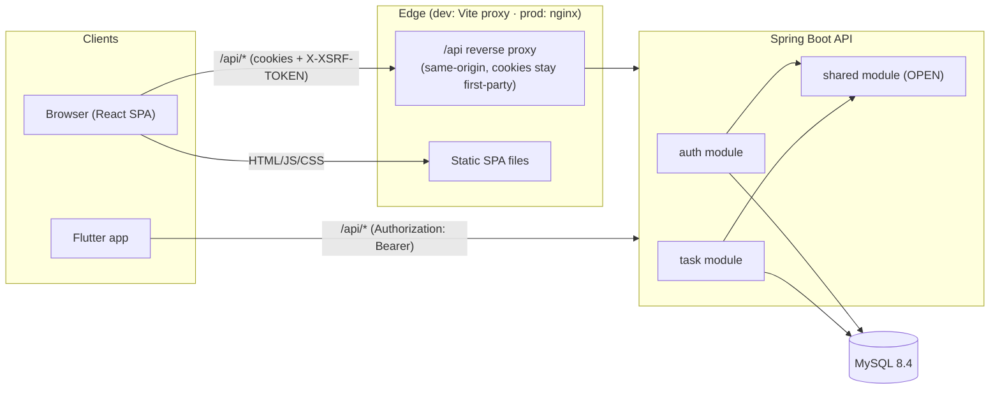
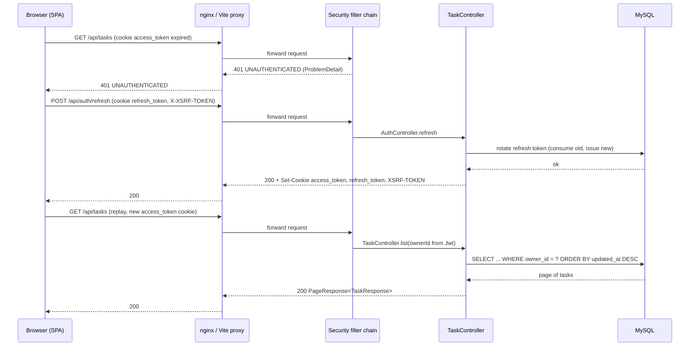
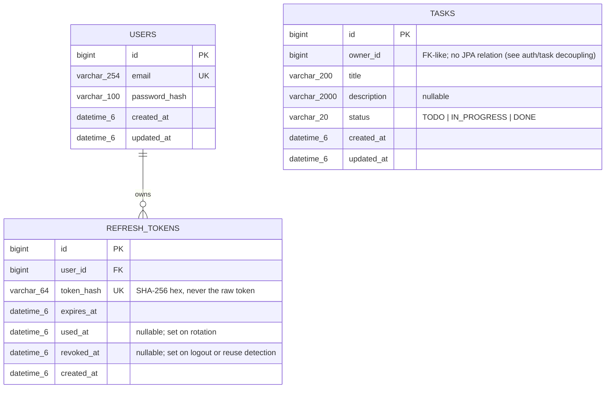

# Architecture

## Components

The web client never calls the API cross-origin: in development Vite proxies `/api` to
`http://localhost:8080`, in production nginx serves the built SPA and reverse-proxies `/api` to the backend
Cloud Run service. This keeps the `SameSite=Strict` auth cookies and the CSRF cookie first-party. The
mobile app has no same-origin constraint and talks to the API directly with a Bearer token. See
`docs/deployment.md` for the production topology.

## Modules (Spring Modulith)

The backend is one Spring Boot application split into three `@ApplicationModule`s under
`io.github.navysama.taskmanager`:

| Module | Type | Contains | Allowed dependencies |
|---|---|---|---|
| `shared` | `OPEN` | `ProblemDetail` error model (`ErrorCode`, `GlobalExceptionHandler`), `PageResponse`/`PageRequests`, `CurrentUser` (reads the caller's id from the `Jwt` principal), cross-cutting `@Configuration` (OpenAPI, `Clock`) | — (leaf; every module may use it) |
| `auth` | named | Accounts, BCrypt password hashing, JWT issuing/validation (`JwtConfig`, `TokenService`), refresh-token rotation, cookies (`AuthCookies`), the Spring Security filter chain (`SecurityConfig`), `AuthController` | `shared` |
| `task` | named | Task CRUD, filter/search `Specification`s, `TaskController` | `shared` |

Each module keeps its implementation under an `internal` sub-package (e.g.
`auth.internal.security`, `task.internal.repository`); classes in `internal` are package-private or
otherwise inaccessible from outside the module, so `task` cannot reach into `auth`'s persistence layer even
by accident. `task` identifies the task owner by the `Long ownerId` carried in every `Task` row and read
from the JWT subject claim — there is no JPA relationship to `auth`'s `User` entity, which is what lets the
two modules stay decoupled. A `ModularityTest` (`backend/src/test/java/.../ModularityTest.java`) runs
`ApplicationModules.of(...).verify()` on every build and fails if a boundary is violated.

## Request flow: an authenticated web request

Example: the SPA lists tasks after the access-token cookie has expired.

The client-side half of this (single-flight refresh, replay-once) is implemented in
`frontend/src/lib/api-client.ts`. See `docs/security.md` for the full login/refresh/logout sequences and
the reuse-detection path.

## Data model

`tasks.owner_id` references `users.id` at the database level (`ON DELETE CASCADE`) but is deliberately not
a JPA `@ManyToOne` — see the module boundary note above. Indexes: `tasks(owner_id, status, updated_at)` and
`tasks(owner_id, updated_at)` serve the list endpoint's filter and sort; `refresh_tokens(user_id)` serves
the "revoke all sessions" reuse-detection path. Full DDL:
`backend/src/main/resources/db/migration/V1__init_schema.sql`.

## Profiles and configuration

| Profile | Used for | Notable settings |
|---|---|---|
| `dev` (default) | `./mvnw spring-boot:run` against the docker-compose MySQL | `app.auth.cookie-secure=false` (plain HTTP locally), debug logging |
| `test` | `@SpringBootTest` / `@ActiveProfiles("test")` | H2 in MySQL mode (`MODE=MySQL`), a throwaway JWT secret, Flyway still runs the real migration |
| `prod` | Cloud Run | `server.forward-headers-strategy=framework` (trusts `X-Forwarded-*` behind the TLS-terminating proxy), `app.auth.cookie-secure=true` |

All three read `spring.datasource.*`, `app.jwt.secret`, `app.jwt.issuer`, `app.jwt.access-token-ttl`
(`15m`), `app.jwt.refresh-token-ttl` (`7d`) and `app.cors.allowed-origins` from environment variables
(`DATABASE_URL`, `DATABASE_USERNAME`, `DATABASE_PASSWORD`, `JWT_SECRET`, `CORS_ALLOWED_ORIGINS`), loaded
either from `backend/.env` locally (`spring.config.import=optional:file:.env[.properties]`) or injected
directly in CI/Cloud Run. See `backend/README.md` for the full table.
