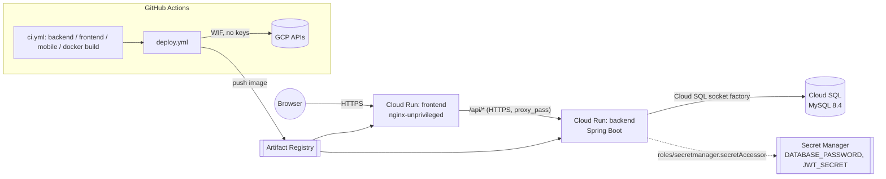

# Deployment

Deployment target (D12): **Google Cloud Run** for the backend and the nginx-served frontend, **Cloud
SQL for MySQL 8.4**, secrets in **Secret Manager**, images in **Artifact Registry**, and GitHub →
GCP authentication via **Workload Identity Federation** (no JSON service-account keys).

## Architecture



The frontend container never talks to MySQL and the browser never talks to the backend origin
directly: nginx reverse-proxies `/api/` to `BACKEND_URL`, so cookies (HttpOnly access/refresh +
XSRF-TOKEN) stay first-party on the frontend's own origin. The backend trusts
`X-Forwarded-*` (`server.forward-headers-strategy=framework`, `prod` profile) to rebuild the
original scheme/host when needed.

## One-time GCP setup

Run once per environment (replace the placeholders). Requires `gcloud` authenticated as a user
with Owner/Editor on the project.

```bash
export PROJECT_ID="your-project-id"
export REGION="europe-west1"
export REPO="task-manager"
export SQL_INSTANCE="task-manager-db"
export DB_NAME="taskmanager"
export DB_USER="taskmanager"
export GH_REPO="your-org/task_manager"   # owner/repo, used in the WIF attribute-condition

# 1. Enable the required APIs
gcloud services enable \
  run.googleapis.com \
  sqladmin.googleapis.com \
  artifactregistry.googleapis.com \
  secretmanager.googleapis.com \
  iamcredentials.googleapis.com \
  --project="$PROJECT_ID"

# 2. Artifact Registry repository (Docker format)
gcloud artifacts repositories create "$REPO" \
  --repository-format=docker \
  --location="$REGION" \
  --project="$PROJECT_ID"

# 3. Cloud SQL instance (smallest tier) + database + user
gcloud sql instances create "$SQL_INSTANCE" \
  --database-version=MYSQL_8_4 \
  --edition=ENTERPRISE \
  --tier=db-f1-micro \
  --region="$REGION" \
  --storage-size=10GB \
  --storage-type=HDD \
  --no-backup \
  --project="$PROJECT_ID"

gcloud sql databases create "$DB_NAME" --instance="$SQL_INSTANCE" --project="$PROJECT_ID"

# Generates the password locally so it never appears in shell history/CI logs unencrypted.
DB_PASSWORD="$(openssl rand -base64 24)"
gcloud sql users create "$DB_USER" \
  --instance="$SQL_INSTANCE" \
  --password="$DB_PASSWORD" \
  --project="$PROJECT_ID"

# 4. Secret Manager secrets
printf '%s' "$DB_PASSWORD" | gcloud secrets create DATABASE_PASSWORD --data-file=- --project="$PROJECT_ID"
openssl rand -base64 32 | tr -d '\n' | gcloud secrets create JWT_SECRET --data-file=- --project="$PROJECT_ID"

# 5. Runtime service account (used BY the Cloud Run services)
gcloud iam service-accounts create task-manager-run \
  --display-name="Task Manager Cloud Run runtime" \
  --project="$PROJECT_ID"
RUN_SA="task-manager-run@${PROJECT_ID}.iam.gserviceaccount.com"

gcloud projects add-iam-policy-binding "$PROJECT_ID" \
  --member="serviceAccount:${RUN_SA}" --role="roles/cloudsql.client"
gcloud projects add-iam-policy-binding "$PROJECT_ID" \
  --member="serviceAccount:${RUN_SA}" --role="roles/secretmanager.secretAccessor"

# 6. Deployer service account (used BY GitHub Actions)
gcloud iam service-accounts create task-manager-deployer \
  --display-name="Task Manager GitHub Actions deployer" \
  --project="$PROJECT_ID"
DEPLOYER_SA="task-manager-deployer@${PROJECT_ID}.iam.gserviceaccount.com"

gcloud projects add-iam-policy-binding "$PROJECT_ID" \
  --member="serviceAccount:${DEPLOYER_SA}" --role="roles/run.admin"
gcloud projects add-iam-policy-binding "$PROJECT_ID" \
  --member="serviceAccount:${DEPLOYER_SA}" --role="roles/artifactregistry.writer"
gcloud projects add-iam-policy-binding "$PROJECT_ID" \
  --member="serviceAccount:${DEPLOYER_SA}" --role="roles/iam.serviceAccountUser"

# 7. Workload Identity Federation: pool + provider restricted to this repo, no JSON keys
gcloud iam workload-identity-pools create "github-pool" \
  --location="global" --project="$PROJECT_ID"

gcloud iam workload-identity-pools providers create-oidc "github-provider" \
  --location="global" \
  --workload-identity-pool="github-pool" \
  --issuer-uri="https://token.actions.githubusercontent.com" \
  --attribute-mapping="google.subject=assertion.sub,attribute.repository=assertion.repository,attribute.ref=assertion.ref" \
  --attribute-condition="assertion.repository=='${GH_REPO}' && assertion.ref=='refs/heads/main'" \
  --project="$PROJECT_ID"
# Note: with this attribute-condition, only workflow runs triggered from refs/heads/main can mint
# a token (pushes to main, and workflow_dispatch run against main). A workflow_dispatch run
# against any other branch is refused by GCP at the token-exchange step — this is intended: it
# keeps deploys restricted to main even though deploy.yml can, in principle, be dispatched
# manually from another branch.

gcloud iam service-accounts add-iam-policy-binding "$DEPLOYER_SA" \
  --role="roles/iam.workloadIdentityUser" \
  --member="principalSet://iam.googleapis.com/projects/$(gcloud projects describe "$PROJECT_ID" --format='value(projectNumber)')/locations/global/workloadIdentityPools/github-pool/attribute.repository/${GH_REPO}" \
  --project="$PROJECT_ID"

# Provider resource name needed for the GCP_WORKLOAD_IDENTITY_PROVIDER variable below
gcloud iam workload-identity-pools providers describe "github-provider" \
  --location="global" --workload-identity-pool="github-pool" \
  --format="value(name)" --project="$PROJECT_ID"
```

The backend Cloud Run service runs as the runtime service account (`task-manager-run`), passed by
`deploy.yml` through the `RUNTIME_SERVICE_ACCOUNT` variable, so the default compute service account
never needs Cloud SQL or Secret Manager access.

## GitHub configuration

Repository **variables** (Settings → Secrets and variables → Actions → Variables) — none of these
are secret, they are project identifiers:

| Variable                          | Example                                                                     |
| ---------------------------------- | ---------------------------------------------------------------------------- |
| `GCP_PROJECT_ID`                   | `your-project-id`                                                            |
| `GCP_REGION`                       | `europe-west1`                                                               |
| `GAR_REPOSITORY`                   | `task-manager`                                                               |
| `CLOUDSQL_INSTANCE`                | `your-project-id:europe-west1:task-manager-db`                              |
| `DB_NAME`                          | `taskmanager`                                                                |
| `DB_USER`                          | `taskmanager`                                                                |
| `GCP_WORKLOAD_IDENTITY_PROVIDER`   | output of the last `gcloud iam workload-identity-pools providers describe` |
| `GCP_SERVICE_ACCOUNT`              | `task-manager-deployer@your-project-id.iam.gserviceaccount.com`             |
| `RUNTIME_SERVICE_ACCOUNT`          | `task-manager-run@your-project-id.iam.gserviceaccount.com`                  |

Create a `production` **environment** (Settings → Environments) if you want manual approval or
protection rules before `deploy.yml` runs — the workflow already targets `environment: production`.

Actual secrets (`DATABASE_PASSWORD`, `JWT_SECRET`) live only in Secret Manager, referenced by the
Cloud Run `--set-secrets` flag; they are never GitHub secrets and never appear in workflow logs.

## Running the full stack locally

```bash
cp .env.example .env   # fill in MYSQL_*, JWT_SECRET (openssl rand -base64 32)
docker compose --profile app up -d --build
```

This builds and starts MySQL, the backend and the frontend; the app is served at
`http://localhost:8080` (nginx proxies `/api/` to the backend container over the compose network).
`docker compose up -d` (no `--profile`) still starts MySQL only, unchanged from before this change.

## Rollback

Cloud Run keeps previous revisions; traffic can be pointed back at the last-known-good one without
a rebuild:

```bash
gcloud run services update-traffic task-manager-backend  --region="$REGION" --to-revisions=PREVIOUS=100
gcloud run services update-traffic task-manager-frontend --region="$REGION" --to-revisions=PREVIOUS=100
```

`deploy.yml` prints both service URLs and this exact command pair to the job's
`$GITHUB_STEP_SUMMARY` on every run.

## Cost notes

- Cloud SQL has **no free tier**: `db-f1-micro` + 10GB HDD is the cheapest MySQL 8.4 option
  (a few dollars/month) but it runs continuously, unlike Cloud Run.
- Both Cloud Run services use `--min-instances=0`: they scale to zero and cost nothing when idle,
  at the price of a cold start on the first request after a quiet period.
- Artifact Registry storage and image pulls are billed but negligible at this scale.

## Known trade-offs

- The local compose `app` profile runs the backend on its default ("dev") Spring profile, not
  `prod`: it's plain HTTP end-to-end, so `app.auth.cookie-secure=false` is correct there but the
  `prod` profile's `forward-headers-strategy=framework` is never exercised locally — only on Cloud
  Run.
- `frontend/nginx/default.conf.template` forwards `X-Forwarded-Proto` from
  `$http_x_forwarded_proto`, which Cloud Run's front end sets; behind a different proxy (or in the
  local compose stack, where nothing sets it) that header is simply absent, which is harmless only
  because `app.auth.cookie-secure=false` locally.
- No Docker `HEALTHCHECK` is defined in either image: Cloud Run's own HTTP probing
  (`/actuator/health*`, already public in `SecurityConfig`) and the compose `depends_on:
  condition: service_healthy` on MySQL cover startup ordering; adding container-level healthchecks
  too was judged unnecessary for this scope.
- The Cloud Run `--set-secrets` references point at the `:latest` alias of each Secret Manager
  secret, not a pinned numeric version. Cloud Run resolves `:latest` to a concrete version number
  at deploy time and bakes that into the revision, so rolling back to a previous revision still
  serves the secret version it was originally deployed with — rollback is safe. The trade-off is
  that a secret rotation (adding a new version and disabling the old one) only takes effect on the
  *next* deploy, not immediately; pin explicit versions (e.g. `DATABASE_PASSWORD:3`) instead of
  `:latest` if a stricter audit trail of "which secret version is live right now" is required.
- The backend Cloud Run service is deployed with `--allow-unauthenticated`, so it is reachable
  directly (bypassing the frontend's `/api/` proxy) by anyone who has its URL. This is considered
  acceptable because the API is already protected by its own JWT + CSRF checks regardless of the
  caller's path. Making it private (`--no-allow-unauthenticated`) would require nginx to mint and
  attach a Cloud Run identity token on every proxied request (service-to-service auth), which is
  out of scope for this project.
- GitHub Actions in the CI/CD workflows are pinned by major version tag (e.g. `actions/checkout@v4`),
  not by commit SHA. A tag can be moved by the action's maintainer (or, if their account is
  compromised, by an attacker) to point at different code without changing the version number seen
  in the workflow file. This is judged acceptable for this scope; for a production setup, pin
  actions by full commit SHA and use Dependabot (or Renovate) to keep those SHAs up to date.
