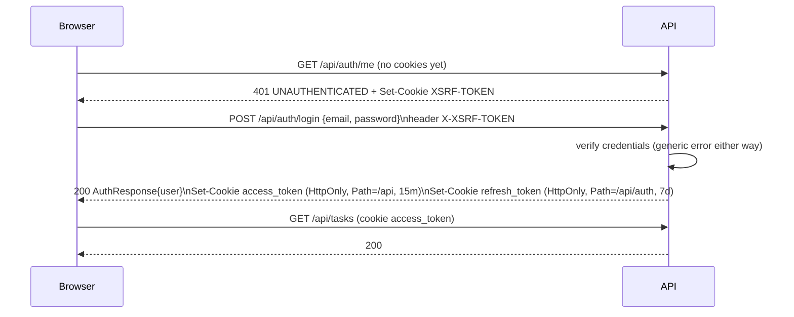
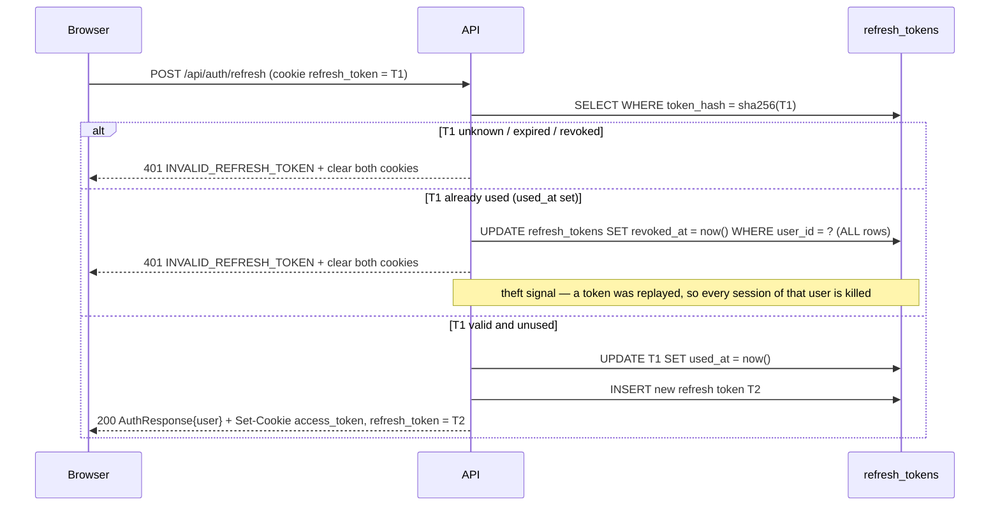
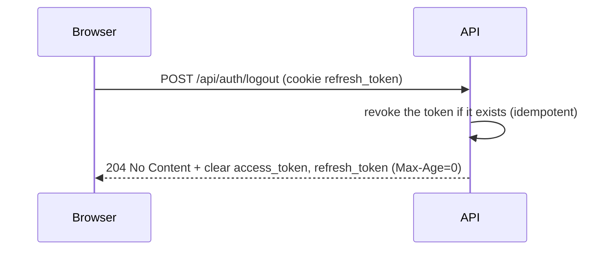
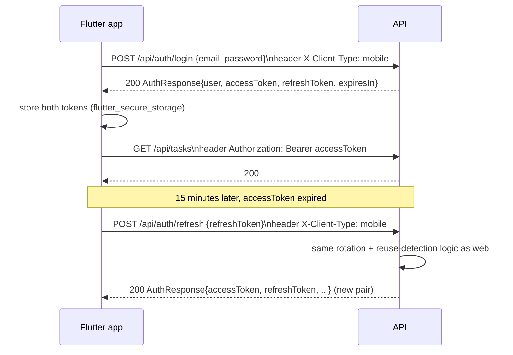

# Security design

Full endpoint-level contract (cookies, headers, error codes): `docs/api-contract.md`. This document covers
the *why* and the token/session mechanics.

## Token model

- **Access token:** stateless JWT, HS256, signed with a secret read from the environment (`JWT_SECRET`,
  Base64, ≥ 256 bits — the app refuses to start otherwise). 15-minute lifetime. Validated on every request
  by signature, expiry and issuer only — no database lookup, so it stays fast under load.
- **Refresh token:** opaque, 256 bits of `SecureRandom`, Base64url-encoded. The API never stores the raw
  value — only its SHA-256 hash (`refresh_tokens.token_hash`). 7-day lifetime. Every use rotates it: the
  old row is marked `used_at` and a new token is issued.
- **Password storage:** BCrypt (`BCryptPasswordEncoder`, Spring Security default work factor).

## Web login

The SPA calls `GET /api/auth/me` at boot specifically to obtain the CSRF cookie before the first mutating
request (`docs/api-contract.md` §5) — a `401` response still carries the `Set-Cookie: XSRF-TOKEN` header
because the CSRF filter runs before authorization.

## Web refresh (and reuse detection)

Rotation with a `used_at` flag turns any replay of an already-consumed refresh token into a detectable
event: under normal operation a token is used exactly once, so a second use means either the legitimate
client retried a token it already rotated away from (a client bug) or an attacker captured the cookie
value. Either way, the response is the same — revoke everything, force a fresh login — because the API
cannot tell the two apart, and treating a bug as harmless would also make theft harmless.

## Web logout

Always `204`, even with no cookie or an already-revoked token — logout must never fail in a way that leaves
the client unsure whether it is signed out.

## Mobile login and refresh

Mobile carries both tokens in the JSON body instead of cookies (there is no browser to manage them), but
goes through the exact same `TokenService` — one rotation/reuse-detection implementation serves both
clients.

## CSRF (double-submit cookie)

- The `XSRF-TOKEN` cookie is **not** `HttpOnly`: the SPA reads it and axios copies its value into the
  `X-XSRF-TOKEN` header on every same-origin `POST`/`PUT`/`DELETE` automatically
  (`frontend/src/lib/api-client.ts`, `withXSRFToken` default).
- The server compares the header against the token it issued (`CookieCsrfTokenRepository`,
  `SameSite=Strict`). A missing or mismatched header on a browser-mode mutation is rejected with
  `403 CSRF_TOKEN_INVALID`.
- Requests are exempt from CSRF when they cannot plausibly come from a cross-site HTML form: an
  `Authorization: Bearer` header or `X-Client-Type: mobile` header, because a browser cannot attach a
  custom header to a cross-site request without a CORS preflight, and the API's CORS policy has no
  cross-origin allow-list by default (`ClientRequests.isNonBrowserClient`).
- `CsrfCookieFilter` forces the token to be materialized (and thus the cookie written) on the very first
  request, since Spring Security otherwise generates it lazily and a plain `GET` would not hand it out.

## Token resolution order

For every protected request, `CookieOrHeaderBearerTokenResolver` decides where the access token comes
from, in this order:

1. **`Authorization: Bearer <token>` header** — mobile, or any Bearer-authenticated caller.
2. **`access_token` cookie** — web, only if no Bearer header was present.
3. Neither present (or the request targets a public `/api/auth/**` endpoint) → no token resolved → the
   endpoint is either public or the request fails authentication with `401 UNAUTHENTICATED`.

Public auth endpoints (`register`, `login`, `refresh`, `logout`) never attempt to resolve a token at all,
so a stale/expired `access_token` cookie can never turn a login or refresh call into an unrelated 401.

## Threat notes and deliberate limits

**Mitigated:**
- Token theft via XSS on the web client — the access and refresh tokens are `HttpOnly`; JavaScript cannot
  read them.
- CSRF on the web client — double-submit cookie on every mutation.
- Refresh-token replay — rotation + reuse detection revokes the whole session set, not just the one token.
- Enumeration of accounts/tasks — login failure is the same `INVALID_CREDENTIALS` whether the email is
  unknown or the password is wrong; a task owned by someone else returns `404 TASK_NOT_FOUND`, never `403`.
- Credential storage — BCrypt for passwords, SHA-256 for refresh tokens (never stored in clear text).
- Information leakage in errors — `500` responses never expose an internal message or stack trace
  (`GlobalExceptionHandler`).

**Known, deliberate limits (see also `docs/decisions.md` and the root README's "known limitations"):**
- No login rate limiting / brute-force lockout in this MVP — flagged as debt, not silently overlooked.
- No device/session listing or per-device revocation — reuse detection revokes *all* of a user's refresh
  tokens, which is coarse but simple and correct.
- CORS has no allowed origins by default (same-origin only); a misconfigured `CORS_ALLOWED_ORIGINS` in a
  future multi-origin deployment would need review before going live.
- The JWT secret is a single static HMAC key with no rotation mechanism.
