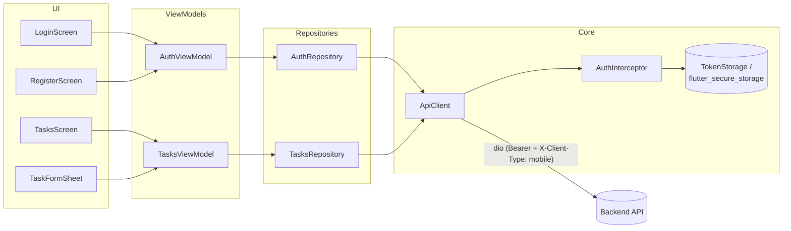

<div align="center">

# 📱 Task Manager — Mobile

### Flutter (Android) client for the Task Manager recruitment test

JWT auth (register/login/logout) and a task list with filtering, search, pagination and create/edit/delete

[](https://flutter.dev/)
[](https://dart.dev/)
[](https://pub.dev/packages/dio)
[](#-known-limitations)

[Root README](../README.md) • [Quick Start](#-quick-start) • [Architecture](#-architecture) • [Tests](#-tests)

</div>

---

## 📋 Table of Contents

- [Overview](#-overview)
- [Features](#-features)
- [Architecture](#-architecture)
- [Tech Stack](#-tech-stack)
- [Prerequisites](#-prerequisites)
- [Quick Start](#-quick-start)
- [Project Structure](#-project-structure)
- [Tests](#-tests)
- [Design Decisions & Trade-offs](#-design-decisions--trade-offs)
- [Known Limitations](#-known-limitations)
- [Troubleshooting](#-troubleshooting)

---

## 🎯 Overview

Android client for the Task Manager recruitment test: JWT auth (register, login, logout) and a task list with filtering, search, pagination and create/edit/delete. Built with Flutter (stable), `dio`, `flutter_secure_storage` and `provider`. See the [root README](../README.md) for the full-stack picture and [`docs/api-contract.md`](../docs/api-contract.md) — the single source of truth shared with the backend and the web client; field names and error codes here match it exactly.

---

## ✨ Features

<table>
<tr>
<td width="50%">

**🔐 Auth**

- Register, login, logout (mobile-mode JWT: tokens in the response body, not cookies)
- Session restore on app start (stored refresh token → `GET /api/auth/me`, silently refreshed if the access token has expired)

</td>
<td width="50%">

**✅ Tasks**

- Status filter (All / To do / In progress / Done)
- Debounced search (~300 ms)
- Pull-to-refresh, infinite scroll pagination
- Create task (FAB → bottom sheet)
- Edit task (tap a row, reuses the same form sheet as `PUT`) and delete task (swipe-to-delete with a confirmation dialog) — nice-to-have, done because they were cheap

</td>
</tr>
<tr>
<td width="50%" colspan="2">

**🎨 UI**

Material 3, light and dark themes from a single seed color. Snackbars for errors and a splash screen while a session is being restored.

</td>
</tr>
</table>

---

## 🏗 Architecture

Repository → ViewModel (`ChangeNotifier`) → Widgets (`provider`), roughly MVVM:



---

## 🛠 Tech Stack

<details open>
<summary><b>🎯 Framework</b></summary>

```
Flutter (stable) 3.29.3  •  Dart SDK ^3.7.2
```

</details>

<details>
<summary><b>📦 Dependencies</b></summary>

| Package                  | Version   | Purpose                                                          |
| ------------------------ | --------- | ---------------------------------------------------------------- |
| `dio`                    | `5.11.1`  | HTTP client (Bearer auth, `X-Client-Type: mobile`, interceptors) |
| `flutter_secure_storage` | `10.3.4`  | Keystore-backed token storage                                    |
| `provider`               | `6.1.5+1` | State management (`ChangeNotifier` view models)                  |
| `cupertino_icons`        | `1.0.8`   | iOS-style icons (from `flutter create`)                          |

</details>

<details>
<summary><b>🧪 Dev Dependencies</b></summary>

| Package         | Version       | Purpose                                        |
| --------------- | ------------- | ---------------------------------------------- |
| `flutter_lints` | `5.0.0`       | Recommended lint set (`analysis_options.yaml`) |
| `flutter_test`  | (Flutter SDK) | Widget & unit testing                          |

</details>

---

## 📦 Prerequisites

<table>
<tr>
<td width="50%">

### 🖥 Required

- ✅ Flutter stable SDK `3.29.3` (`flutter doctor`)
- ✅ Android toolchain (SDK, emulator or physical device)

</td>
<td width="50%">

### 🔌 Backend

- ✅ Backend running locally first — `http://localhost:8080` (see the [root README](../README.md) / `docker-compose.yml`)

</td>
</tr>
</table>

---

## 🚀 Quick Start

### 1️⃣ Install dependencies

```bash
cd mobile
flutter pub get
```

### 2️⃣ Run on an Android emulator (default)

```bash
flutter run --dart-define=API_BASE_URL=http://10.0.2.2:8080
```

The emulator's alias for the host machine's `localhost` is `10.0.2.2`, already used above.

### 3️⃣ Or run on a physical device

The phone cannot reach `10.0.2.2` or `localhost` on the host. Find the machine's LAN IP (e.g. `ipconfig` → IPv4 address) and make sure the backend is reachable from the phone's network (same Wi-Fi, firewall allowing inbound `:8080`):

```bash
flutter run --dart-define=API_BASE_URL=http://<lan-ip>:8080
```

> ⚠️ Plain HTTP is only allowed, in debug builds, by the Android network security config for `10.0.2.2`, `localhost` and `127.0.0.1` (see [Design Decisions & Trade-offs](#-design-decisions--trade-offs)). A LAN IP is a different host, so either add it to `android/app/src/debug/res/xml/network_security_config.xml` for local testing, or point at an HTTPS-enabled backend.

---

## 📁 Project Structure

```
lib/
├── 🧰 core/            # API client (dio), auth interceptor, ApiException (RFC 9457 parsing),
│                       #   TokenStorage (flutter_secure_storage), AppConfig, Strings
├── 🗂 features/
│   ├── 🔐 auth/        #   User/AuthResponse models, AuthRepository, AuthViewModel,
│   │                   #   LoginScreen, RegisterScreen, PasswordField, validators
│   └── ✅ tasks/       #   Task/TaskStatus/PageResponse models, TasksRepository, TasksViewModel,
│                       #   TasksScreen, TaskFormSheet, TaskListTile
├── 📱 app.dart         # MaterialApp (Material 3, light/dark), auth gate (splash → login/tasks)
└── 🚪 main.dart        # Composition root: builds ApiClient/repositories/view models, wires providers
```

---

## 🧪 Tests

```bash
flutter test
flutter analyze
```

| Coverage                    | Detail                                                                                                                                                                                       |
| --------------------------- | -------------------------------------------------------------------------------------------------------------------------------------------------------------------------------------------- |
| Models                      | `Task`/`TaskStatus`/`PageResponse` JSON (de)serialization                                                                                                                                    |
| `ApiException`              | Parsing of `problem+json` bodies (with and without field errors, non-JSON bodies, network errors)                                                                                            |
| Auth interceptor            | Attaches the bearer token, refreshes once on a `401` and retries, concurrent `401`s share a single refresh call, a failed refresh clears the session, an already-retried request never loops |
| `TasksViewModel`            | Filter / search / pagination / optimistic delete                                                                                                                                             |
| `LoginScreen` (widget test) | Validation, submit, password visibility toggle, server-error snackbar                                                                                                                        |

The interceptor tests use a hand-written `HttpClientAdapter` fake (a scripted in-memory server) instead of a mocking package, per the project's dependency budget.

---

## 📐 Design Decisions & Trade-offs

- **Secure storage for tokens.** `flutter_secure_storage` (Keystore-backed on Android) rather than `SharedPreferences`, since the refresh token is a 7-day bearer credential.
- **Token rotation handling.** The API rotates the refresh token on every `/auth/refresh` call and revokes all sessions if an old one is reused. The interceptor always persists the _new_ pair atomically after a refresh and shares one in-flight refresh across concurrent `401`s, so two requests racing to refresh can never send two different (and mutually invalidating) refresh tokens.
- **Single retry, no loop.** A request is retried at most once after a refresh; if it still fails the error surfaces normally instead of retrying indefinitely.
- **Cleartext only for local dev, debug builds only.** `network_security_config.xml` lives under `android/app/src/debug/res/xml/` (not `src/main`) and is wired up only from `android/app/src/debug/AndroidManifest.xml`, so the manifest merger never packages it — or the `android:networkSecurityConfig` attribute — into a release build. It scopes cleartext to `10.0.2.2` / `localhost` / `127.0.0.1` only; every other host still requires HTTPS. Release builds also set `android:allowBackup="false"` on the main manifest to keep the OS from backing up app data (including anything cached outside `flutter_secure_storage`'s Keystore-backed store).
- **English UI only.** All copy lives in `lib/core/strings.dart` so localizing later (`intl` + ARB files) is a matter of extracting those constants; out of scope for this test.
- **No routing package.** The app is two top-level screens plus one pushed screen (Register), so `Navigator`/`MaterialPageRoute` was simpler and lighter than adding `go_router`.
- **Simple pagination, no caching layer.** Each filter/search change or pull-to-refresh reloads page 0; there's no local cache/offline support, matching the API contract's guidance that clients simply refetch on focus/resume/refresh.
- **Dependencies kept minimal**, per the project's constraint: `dio`, `flutter_secure_storage`, `provider` (all pre-approved), plus `cupertino_icons` and `flutter_lints` from `flutter create`. No mocking package was needed — hand-written fakes cover every test.

---

## ⚠️ Known Limitations

- No offline mode / local cache.
- No push notifications or background sync.
- iOS is out of scope for this iteration (Android-only, per project scope).
- i18n is a follow-up (see [Design Decisions & Trade-offs](#-design-decisions--trade-offs)).

---

## 🔧 Troubleshooting

<details>
<summary><b>🤖 Emulator can't reach the backend</b></summary>

Use `10.0.2.2`, not `localhost` — the emulator's alias for the host machine. `flutter run --dart-define=API_BASE_URL=http://10.0.2.2:8080`.

</details>

<details>
<summary><b>📱 Physical device can't reach the backend</b></summary>

Point `API_BASE_URL` at the development machine's LAN IP, ensure both devices are on the same Wi-Fi, and that the firewall allows inbound `:8080`. A LAN IP needs to be added to `android/app/src/debug/res/xml/network_security_config.xml` for cleartext HTTP, or the backend needs HTTPS — see [Quick Start](#-quick-start).

</details>

<details>
<summary><b>🩺 `flutter pub get` or `flutter analyze` fails unexpectedly</b></summary>

Confirm the installed Flutter SDK matches the stable channel version this project targets (`3.29.3`, Dart SDK `^3.7.2`) with `flutter doctor`.

</details>

---

<div align="center">

Part of the [Task Manager](../README.md) monorepo.

[⬆ Back to root README](../README.md)

</div>
