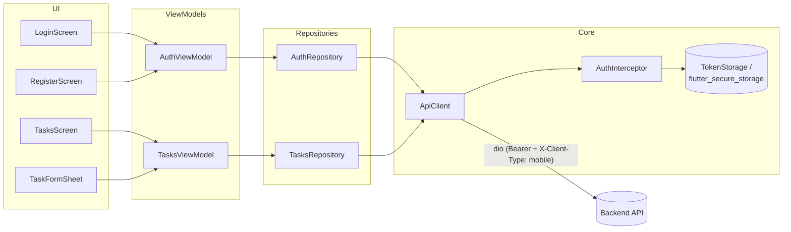

# Task Manager — Mobile (Flutter)

Android client for the Task Manager recruitment test: JWT auth (register, login, logout) and a
task list with filtering, search, pagination and create/edit/delete. Built with Flutter (stable),
`dio`, `flutter_secure_storage` and `provider`.

## Features

- Register, login, logout (mobile-mode JWT: tokens in the response body, not cookies).
- Session restore on app start (stored refresh token → `GET /api/auth/me`, silently refreshed if
  the access token has expired).
- Task list: status filter (All / To do / In progress / Done), debounced search (~300 ms),
  pull-to-refresh, infinite scroll pagination.
- Create task (FAB → bottom sheet).
- Nice-to-have, done because they were cheap: edit task (tap a row, reuses the same form sheet as
  PUT) and delete task (swipe-to-delete with a confirmation dialog).
- Material 3, light and dark themes from a single seed color.
- Snackbars for errors and a splash screen while a session is being restored.

## Architecture

Repository → ViewModel (`ChangeNotifier`) → Widgets (`provider`), roughly MVVM:



```
lib/
  core/            API client (dio), auth interceptor, ApiException (RFC 9457 parsing),
                   TokenStorage (flutter_secure_storage), AppConfig, Strings
  features/
    auth/          User/AuthResponse models, AuthRepository, AuthViewModel,
                   LoginScreen, RegisterScreen, PasswordField, validators
    tasks/         Task/TaskStatus/PageResponse models, TasksRepository, TasksViewModel,
                   TasksScreen, TaskFormSheet, TaskListTile
  app.dart         MaterialApp (Material 3, light/dark), auth gate (splash → login/tasks)
  main.dart        Composition root: builds ApiClient/repositories/view models, wires providers
```

The API contract (`docs/api-contract.md` at the repo root) is the single source of truth shared
with the backend and the web client; field names and error codes here match it exactly.

## Running

Requires the Flutter stable SDK (this project targets `^3.7.2`) and an Android toolchain
(`flutter doctor`).

```bash
cd mobile
flutter pub get

# Android emulator (default): the API base URL already points at 10.0.2.2, the
# emulator's alias for the host machine's localhost.
flutter run --dart-define=API_BASE_URL=http://10.0.2.2:8080
```

Backend must be running locally first (`http://localhost:8080` — see the repo root README /
`docker-compose.yml`).

**Physical device:** the phone cannot reach `10.0.2.2` or `localhost` on the host. Find the
machine's LAN IP (e.g. `ipconfig` → IPv4 address) and make sure the backend is reachable from the
phone's network (same Wi-Fi, firewall allowing inbound `:8080`):

```bash
flutter run --dart-define=API_BASE_URL=http://<lan-ip>:8080
```

Plain HTTP is only allowed by the Android network security config for `10.0.2.2`, `localhost` and
`127.0.0.1` (see Trade-offs below). A LAN IP is a different host, so either add it to
`android/app/src/main/res/xml/network_security_config.xml` for local testing, or point at an
HTTPS-enabled backend.

## Tests

```bash
flutter test
flutter analyze
```

Covers: `Task`/`TaskStatus`/`PageResponse` JSON (de)serialization, `ApiException` parsing of
`problem+json` bodies (with and without field errors, non-JSON bodies, network errors), the auth
interceptor (attaches the bearer token, refreshes once on a `401` and retries, concurrent `401`s
share a single refresh call, a failed refresh clears the session, an already-retried request never
loops), `TasksViewModel` (filter/search/pagination/optimistic delete), and a `LoginScreen` widget
test (validation, submit, password visibility toggle, server-error snackbar).

The interceptor tests use a hand-written `HttpClientAdapter` fake (a scripted in-memory server)
instead of a mocking package, per the project's dependency budget.

## Design decisions & trade-offs

- **Secure storage for tokens.** `flutter_secure_storage` (Keystore-backed on Android) rather than
  `SharedPreferences`, since the refresh token is a 7-day bearer credential.
- **Token rotation handling.** The API rotates the refresh token on every `/auth/refresh` call and
  revokes all sessions if an old one is reused. The interceptor always persists the *new* pair
  atomically after a refresh and shares one in-flight refresh across concurrent `401`s, so two
  requests racing to refresh can never send two different (and mutually invalidating) refresh
  tokens.
- **Single retry, no loop.** A request is retried at most once after a refresh; if it still fails
  the error surfaces normally instead of retrying indefinitely.
- **Cleartext only for local dev.** `usesCleartextTraffic` is scoped via
  `network_security_config.xml` to `10.0.2.2` / `localhost` / `127.0.0.1` only — every other host
  still requires HTTPS. This is a development convenience, not something that should reach a real
  release build talking to a production API.
- **English UI only.** All copy lives in `lib/core/strings.dart` so localizing later (`intl` +
  ARB files) is a matter of extracting those constants; out of scope for this test.
- **No routing package.** The app is two top-level screens plus one pushed screen (Register), so
  `Navigator`/`MaterialPageRoute` was simpler and lighter than adding `go_router`.
- **Simple pagination, no caching layer.** Each filter/search change or pull-to-refresh reloads
  page 0; there's no local cache/offline support, matching the API contract's guidance that
  clients simply refetch on focus/resume/refresh.
- **Dependencies kept minimal**, per the project's constraint: `dio`, `flutter_secure_storage`,
  `provider` (all pre-approved), plus `cupertino_icons` and `flutter_lints` from `flutter create`.
  No mocking package was needed — hand-written fakes cover every test.

## Known limitations

- No offline mode / local cache.
- No push notifications or background sync.
- iOS is out of scope for this iteration (Android-only, per project scope).
- i18n is a follow-up (see above).
